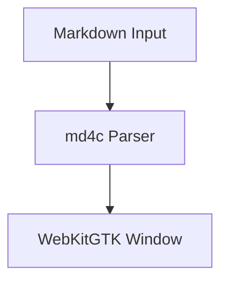

# My Notes

Hello from **mdreader**!

Here is inline math: $E = mc^2$.

Here is display math:
$$\int_0^\infty e^{-x} dx = 1$$

- [x] LaTeX Math: $E = mc^2$
- [x] Native WebKitGTK zero-localhost window

| Component | Technology | Status |
| :--- | :--- | :--- |
| Parser | md4c (C99) | Ready |
| Window | WebKitGTK 6.0 | Ready |

